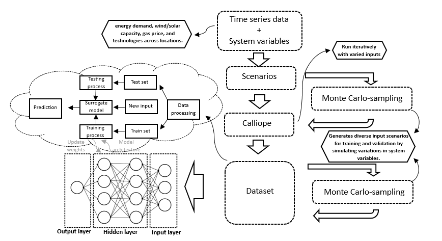

## General work-around

This diagram shows how the neural network-based surrogate model is created and tested 
for energy system analysis. Diagram 1 illustrates the setup of the project and outlines the 
steps that have been undertaken to achieve the results presented in this work. To provide a 
clearer understanding of the project’s progression, a detailed explanation of the diagram is 
provided below.  

 

Firstly, time series data and system information are being collected. The energy system data 
and time series are provided by the supervisor and are accessible here. The inputs include 
onshore wind, offshore wind, photovoltaics, and electricity demand. These inputs are used to 
create various scenarios using Calliope, which will be presented in dataset format. In the 
next step, Monte Carlo sampling is applied to generate a diverse set of input combinations. 
This technique is utilized, for instance, with variables such as wind, gas prices, and time. 
The new scenarios include various combinations, such as wind and time. These newly 
created scenarios from Monte Carlo sampling are different from the original scenarios and 
will be used later in the project to develop a surrogate model. 

The network itself is made up of an input layer, some hidden layers, and an output layer. 
During training, the weights in the network are adjusted step by step so the model can learn 
how the system works. After training, the model is tested with a different dataset to see how 
well it performs. This helps the model make quick predictions for new inputs. Using this 
method, it’s much faster to try out different setups and scenarios compared to running a full 
simulation every time.  

 

## Requirements 

https://github.com/FLomb/Calliope-NL/tree/main/model_files/timeseries_data

The final products are reached by using Calliope and Kaggle. Calliope is a free and 
open-source tool that is specifically designed for energy system modeling. Calliope is widely 
utilized in both research and commercial projects. The framework version which is used in 
this project is 0.6.10. Before attempting to run this model, it is important to ensure that 
Calliope is installed. Kaggle is a platform where people can work together by sharing code 
and other analysis. This is being used in the later part of the project. All the Monte Carlo 
samplings and other models were made with the help of this platform.  

  

## Overview 

The project includes a Jupyter notebook called (model_walkthrough), which guides new 
users through the model. It provides examples of how to use the model for tasks like system 
design or operational analysis and demonstrates how to customize scenarios. This way you 
can go through all the steps that have been made during this project and, if necessary, add 
or delete some code. It is also possible to get different models as output. 

All the input data and model specifications are organized in the in (.....) directory, which 
includes the following key files:  

   

The timeseries_data folder contains time series input data and the (.....) folder is used for 
the locations. Model results are saved in the “results” folder, this already includes example 
outputs created using the Jupyter notebook.  

  

## Limitations 

The model has several limitations because it is not designed to perfectly represent real-world 
systems. Here are some of the most important limitations: 

- The measurement locations have been simplified, potentially limiting the diversity of 
data collection. 

- Not all desired features, particularly those listed as "Could Have" requirements, may 
be implemented due to resource and time constraints. 

- Limited time is available for the development and testing phases of the model, which 
may restrict opportunities for refinement and optimization 

- There is limited technical expertise in key areas, which could impact progress in 
certain aspects of the project. 

- The model is simplified which causes similar results.  

  

## Authors 

- Sara Sorici  
  E-mail: s.sorici@student.tudelft.nl  
- Wouter Bosse  
  E-mail: w.bosse@student.tudelft.nl  
- Mark van Egmond  
  E-mail: m.vanegmond@student.tudelft.nl  
- Lore Tollenaar  
  E-mail: l.tollenaar@student.tudelft.nl  
- Jelle Overdijkink  
  E-mail: j.h.overdijkink@student.tudelft.nl  
- Geert Arends  
  E-mail: g.a.arends@student.tudelft.nl  

  

## Citing 

If you use Calliope for academic work please cite: 

Stefan Pfenninger and Bryn Pickering (2018). Calliope: a multi-scale energy systems 
modelling framework. Journal of Open Source Software, 3(29), 825. doi: 
10.21105/joss.00825  

  

## License 

Copyright 2024 Calliope-NL, contributors listed in Authors  

This work is licensed under a Creative Commons Attribution-NonCommercial-ShareAlike 4.0 
International License.  

Unless required by applicable law or agreed to in writing, software distributed under the 
License is distributed on an "AS IS" BASIS, WITHOUT WARRANTIES OR CONDITIONS OF 
ANY KIND, either express or implied. See the License for the specific language governing 
permissions and limitations under the License.  

https://doi.org/10.21105/joss.00825  
https://doi.org/10.21105/joss.00825  
http://creativecommons.org/licenses/by-nc-sa/4.0/  
http://creativecommons.org/licenses/by-nc-sa/4.0/
